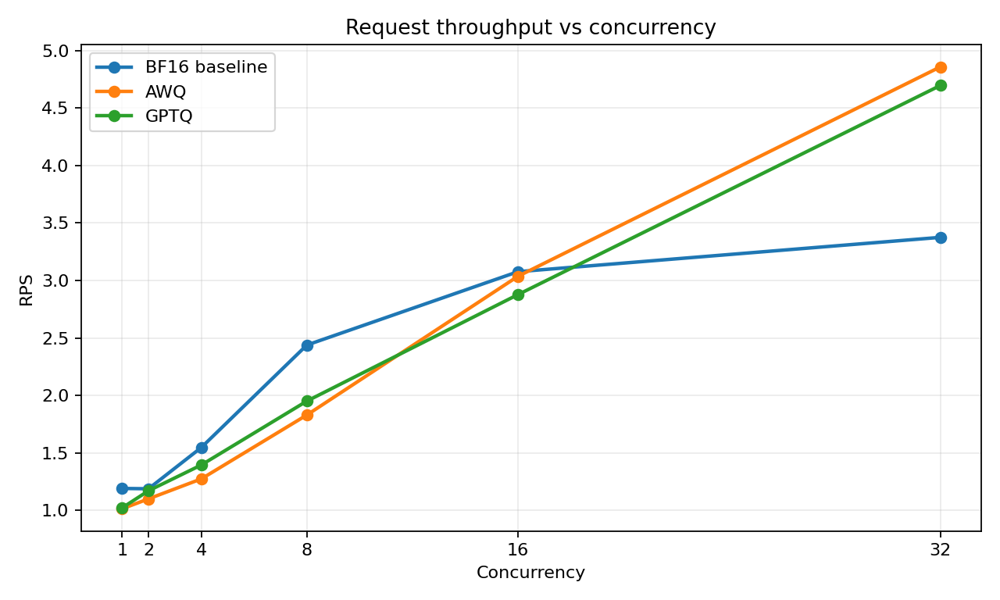
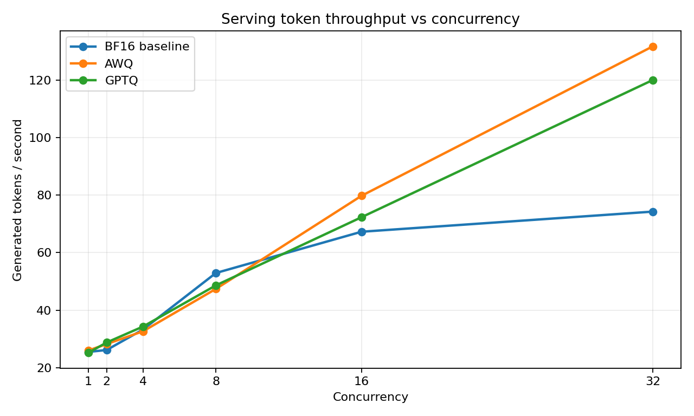
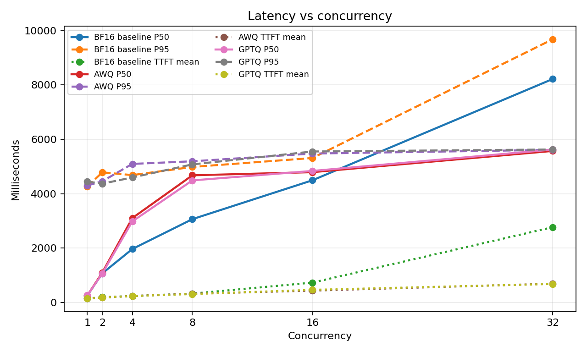

# Qwen3-VL-4B vLLM 并发曲线报告

## 结论

本报告使用 OCRBench `stratified100` 结果分析并发性能曲线。注意：**100 条 stratified
结果只用于观察吞吐和延迟趋势，不用于比较模型准确率**。模型准确率判断应以 1000 条结果为准。

本轮已加入 BF16 baseline。结论变得更明确：BF16 可以作为质量基线，但在 RTX 3080 Ti
12GB 上显存占用明显更高，vLLM 启动后只剩约 `0.21 GiB` KV cache，日志给出的
`Maximum concurrency for 1,024 tokens per request` 只有约 `1.50x`。虽然本数据集仍能跑到
高并发，但 c16/c32 主要靠排队消化请求，TTFT 和请求延迟明显放大，不适合作为默认服务形态。

如果只能选一个默认值，建议使用：

```text
concurrency = 8
模型 = AWQ 或 GPTQ，不建议 BF16 作为 12GB 单卡默认部署模型
```

## 实验口径

性能曲线：

- 数据集：`echo840/OCRBench`
- 采样方式：`stratified`
- 样本数：`100`
- 后端：`vLLM`
- 模型：Qwen3-VL-4B BF16 baseline / AWQ local / GPTQ local
- 并发点：`1, 2, 4, 8, 16, 32`
- `VLLM_USE_FLASHINFER_SAMPLER=0`
- `runtime.max_model_len: 1024`
- `model.max_pixels: 602112`
- `runtime.mm_processor_kwargs.truncation: false`

准确率参考：

- 数据集：`echo840/OCRBench`
- 样本数：`1000`
- 采样方式：`first`
- 已跑并发点：`4, 8`

100 条 stratified 曲线适合观察吞吐和延迟形状，但不适合作为准确率比较依据，因为 1000 条结果呈现了不同的准确率结论。

## 请求吞吐曲线



请求吞吐随并发持续上升，到 `c32` 仍未完全饱和。BF16 的吞吐低于 AWQ/GPTQ，尤其在高并发下差距明显。

- BF16 baseline：从 c1 的 `1.01 RPS` 提升到 c32 的 `3.38 RPS`。
- AWQ：从 c1 的 `1.01 RPS` 提升到 c32 的 `4.86 RPS`。
- GPTQ：从 c1 的 `1.02 RPS` 提升到 c32 的 `4.70 RPS`。

## Token 吞吐曲线



生成 token 吞吐同样随并发上升。量化模型的高并发 token 吞吐明显好于 BF16 baseline。

- BF16 baseline：c32 为 `74.26 tok/s`。
- AWQ：c32 为 `131.70 tok/s`。
- GPTQ：c32 为 `120.00 tok/s`。

## 延迟曲线



并发提高后，吞吐上升，但 P50/P95/TTFT 都会上升。BF16 在 c16/c32 的 TTFT 抬升最明显，说明它在 12GB 单卡上更容易进入排队状态。

- BF16 P50 从 c1 的 `258.7 ms` 上升到 c32 的 `8220.2 ms`。
- AWQ P50 从 c1 的 `249.6 ms` 上升到 c32 的 `5572.3 ms`。
- GPTQ P50 从 c1 的 `256.3 ms` 上升到 c32 的 `5622.7 ms`。
- BF16 c32 的 TTFT mean 为 `2766.4 ms`，显著高于 AWQ/GPTQ 的约 `676-686 ms`。

## Stratified100 性能数据

| 模型 | 并发 | RPS | 生成 tok/s | P50 ms | P95 ms | TTFT mean ms | 失败率 | 异常输出 |
| --- | ---: | ---: | ---: | ---: | ---: | ---: | ---: | ---: |
| BF16 baseline | 1 | 1.1920 | 25.5066 | 248.6 | 4257.4 | 142.3 | 0.0 | 0 |
| BF16 baseline | 2 | 1.1892 | 26.1614 | 1065.3 | 4784.9 | 189.3 | 0.0 | 0 |
| BF16 baseline | 4 | 1.5479 | 33.2936 | 1963.4 | 4683.0 | 231.6 | 0.0 | 0 |
| BF16 baseline | 8 | 2.4391 | 52.9233 | 3061.8 | 4983.6 | 321.6 | 0.0 | 0 |
| BF16 baseline | 16 | 3.0771 | 67.2702 | 4493.1 | 5312.8 | 726.7 | 0.0 | 0 |
| BF16 baseline | 32 | 3.3756 | 74.2640 | 8220.2 | 9683.5 | 2766.4 | 0.0 | 0 |
| AWQ | 1 | 1.0149 | 26.0002 | 249.6 | 4301.1 | 141.4 | 0.0 | 0 |
| AWQ | 2 | 1.1015 | 28.2360 | 1095.1 | 4455.5 | 176.1 | 0.0 | 0 |
| AWQ | 4 | 1.2750 | 32.6689 | 3101.0 | 5095.0 | 233.9 | 0.0 | 0 |
| AWQ | 8 | 1.8308 | 47.3961 | 4675.8 | 5191.7 | 317.7 | 0.0 | 0 |
| AWQ | 16 | 3.0373 | 79.7603 | 4791.2 | 5476.2 | 430.9 | 0.0 | 0 |
| AWQ | 32 | 4.8580 | 131.6953 | 5572.3 | 5612.7 | 685.8 | 0.0 | 0 |
| GPTQ | 1 | 1.0230 | 25.2004 | 256.3 | 4443.9 | 141.7 | 0.0 | 0 |
| GPTQ | 2 | 1.1718 | 28.7768 | 1063.2 | 4367.7 | 173.8 | 0.0 | 0 |
| GPTQ | 4 | 1.3960 | 34.3195 | 2979.1 | 4596.5 | 233.2 | 0.0 | 0 |
| GPTQ | 8 | 1.9517 | 48.6216 | 4488.3 | 5077.3 | 304.7 | 0.0 | 0 |
| GPTQ | 16 | 2.8781 | 72.3152 | 4836.6 | 5552.1 | 460.5 | 0.0 | 0 |
| GPTQ | 32 | 4.6964 | 119.9990 | 5622.7 | 5625.6 | 676.1 | 0.0 | 0 |

## 1000 条准确率参考

| 模型 | 并发 | Accuracy | Correct | RPS | 生成 tok/s |
| --- | ---: | ---: | ---: | ---: | ---: |
| BF16 baseline | 4 | 0.863 | 863/1000 | 1.5504 | 54.9950 |
| BF16 baseline | 8 | 0.863 | 863/1000 | 1.7839 | 63.6378 |
| AWQ | 4 | 0.854 | 854/1000 | 1.8601 | 71.6734 |
| AWQ | 8 | 0.855 | 855/1000 | 3.0367 | 118.1886 |
| GPTQ | 4 | 0.854 | 854/1000 | 1.7744 | 67.4203 |
| GPTQ | 8 | 0.854 | 854/1000 | 3.0672 | 118.1567 |

1000 条结果显示，BF16 baseline 的准确率略高于 AWQ/GPTQ，但吞吐和延迟不占优。AWQ/GPTQ 的准确率基本持平，因此 100 条 stratified
结果不应作为模型质量结论依据。

## 结果解读

BF16 baseline 的价值是作为质量上限和精度参考，不适合作为当前 12GB 单卡的默认部署模型。它在 c32 仍能完成实验，但 TTFT 和 P50 延迟已经明显高于量化模型，说明高并发收益主要来自排队批处理，而不是健康的在线服务延迟。

AWQ/GPTQ 更适合本项目当前的边缘推理部署实验。AWQ 在 c16/c32 的吞吐更好；GPTQ 在 c1-c8 的请求吞吐略好。1000 条准确率参考显示二者质量差距很小，实际选择应优先看吞吐、延迟和部署兼容性。

## 具体建议

| 场景 | 推荐模型 | 推荐并发 | 说明 |
| --- | --- | ---: | --- |
| 默认部署 / 报告主推荐 | AWQ 或 GPTQ | 8 | 吞吐相比 c4 明显提高，延迟低于 c16/c32 |
| 低延迟优先 | AWQ/GPTQ，必要时 BF16 | 1-2 | 适合 demo、交互式问答、低请求量场景 |
| 吞吐优先 | AWQ 优先，其次 GPTQ | 16 | 适合后台批处理或可接受数秒级延迟的服务 |
| 压测上限 / 曲线右端点 | AWQ/GPTQ | 32 | 吞吐最高，但延迟最高，不建议默认使用 |
| 质量基线 | BF16 baseline | 4 或 8 | 用于和量化模型做质量对照，不建议作为 12GB 默认服务模型 |

最终推荐：

```text
默认并发: 8
默认部署模型: AWQ 或 GPTQ
质量基线: BF16 baseline
低延迟配置: 1 或 2
吞吐优先配置: 16
压测上限配置: 32
```

如果项目里只保留一个默认 benchmark/serving 配置，建议使用 `concurrency=8`；如果要展示量化收益，报告主线应写成 BF16 baseline vs AWQ/GPTQ。

## 源文件

性能曲线 JSON：

```text
outputs/qwen3vl_4b_bf16_vllm_ocrbench_stratified100_c1.json
outputs/qwen3vl_4b_bf16_vllm_ocrbench_stratified100_c2.json
outputs/qwen3vl_4b_bf16_vllm_ocrbench_stratified100_c4.json
outputs/qwen3vl_4b_bf16_vllm_ocrbench_stratified100_c8.json
outputs/qwen3vl_4b_bf16_vllm_ocrbench_stratified100_c16.json
outputs/qwen3vl_4b_bf16_vllm_ocrbench_stratified100_c32.json
outputs/qwen3vl_4b_awq_vllm_ocrbench_stratified100_c1.json
outputs/qwen3vl_4b_awq_vllm_ocrbench_stratified100_c2.json
outputs/qwen3vl_4b_awq_vllm_ocrbench_stratified100_c4.json
outputs/qwen3vl_4b_awq_vllm_ocrbench_stratified100_c8.json
outputs/qwen3vl_4b_awq_vllm_ocrbench_stratified100_c16.json
outputs/qwen3vl_4b_awq_vllm_ocrbench_stratified100_c32.json
outputs/qwen3vl_4b_gptq_vllm_ocrbench_stratified100_c1.json
outputs/qwen3vl_4b_gptq_vllm_ocrbench_stratified100_c2.json
outputs/qwen3vl_4b_gptq_vllm_ocrbench_stratified100_c4.json
outputs/qwen3vl_4b_gptq_vllm_ocrbench_stratified100_c8.json
outputs/qwen3vl_4b_gptq_vllm_ocrbench_stratified100_c16.json
outputs/qwen3vl_4b_gptq_vllm_ocrbench_stratified100_c32.json
```

准确率参考 JSON：

```text
outputs/qwen3vl_4b_bf16_vllm_ocrbench_first1000_c4.json
outputs/qwen3vl_4b_bf16_vllm_ocrbench_first1000_c8.json
outputs/qwen3vl_4b_awq_vllm_ocrbench_first1000_c4.json
outputs/qwen3vl_4b_awq_vllm_ocrbench_first1000_c8.json
outputs/qwen3vl_4b_gptq_vllm_ocrbench_first1000_c4.json
outputs/qwen3vl_4b_gptq_vllm_ocrbench_first1000_c8.json
```
